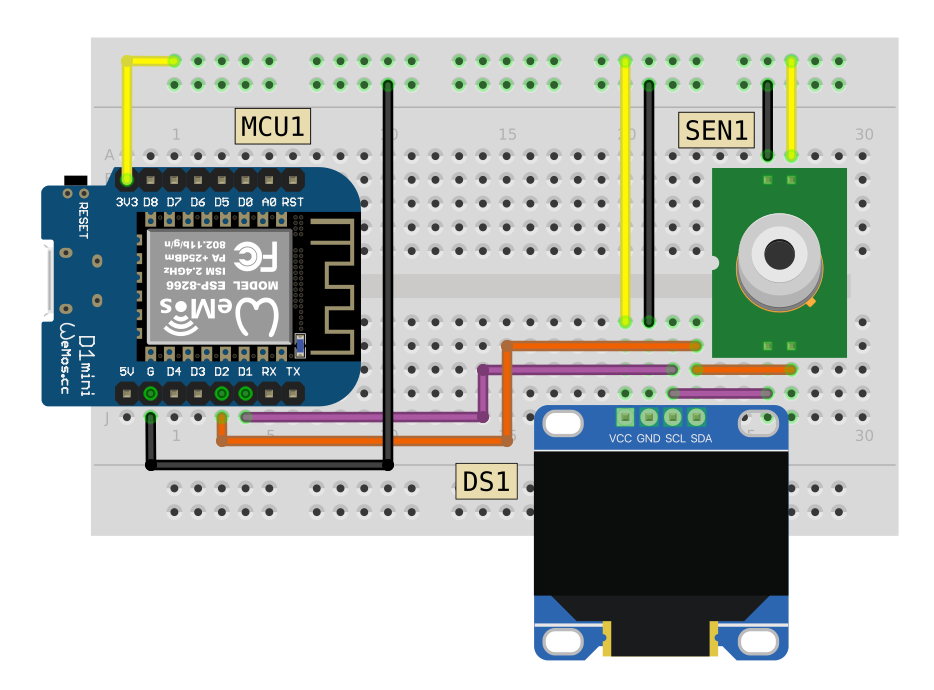

# Contactless Thermometer

## Breadboard Circuit

## Component List

|Code|Description|
|:--|:--|
|MCU1|Wemos D1 Mini|
|SEN1|MLX90614 Infrared Thermometer|
|DS1|SSD1306 128x64 OLED Display (I2C)|

## Libraries Used

1. [Adafruit MLX90614 Library](https://github.com/adafruit/Adafruit-MLX90614-Library)
